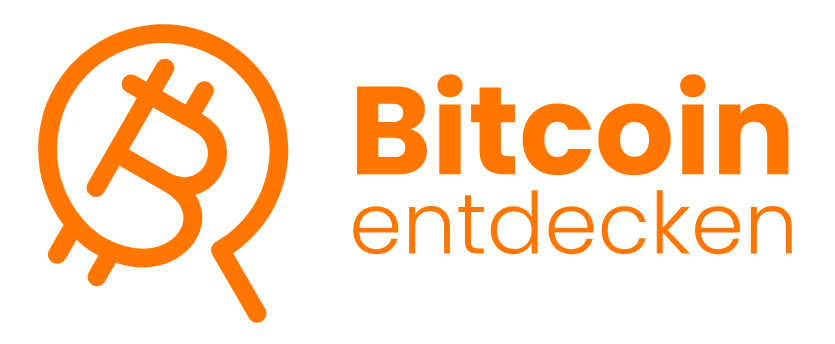

# Bitcoin entdecken Brand - Open Source

Dies ist das offizielle Open-Source-Repository für die "Bitcoin entdecken" Brand. Es enthält alle Ressourcen – Logos, Vorlagen und Richtlinien –, um einheitliche und professionelle Materialien für "Bitcoin entdecken"-Veranstaltungen zu erstellen.

## Unsere Vision

Unsere Vision ist es, die "Bitcoin entdecken"-Bewegung im gesamten deutschsprachigen Raum mit einer starken und wiedererkennbaren Marke zu unterstützen. Inspiriert durch den ersten DACH-weiten "Bitcoin entdecken"-Tag am 8. Februar 2025, möchten wir mit dieser Initiative eine offene und professionelle Grundlage für alle zukünftigen Veranstaltungen schaffen.

Diese Brand soll von jedem frei genutzt, angepasst und weiterentwickelt werden. Wir wollen die Community ermutigen, diese Materialien zu nutzen, um die Bitcoin-Bildung voranzutreiben.

## Die Entstehungsgeschichte

Die "Bitcoin entdecken" Brand wurde ursprünglich für den Stand von Bitcoin Austria auf dem A1 eSports Festival 2025 in Wien entwickelt. Die überwältigend positive Resonanz und der Erfolg der Aktion haben uns motiviert, die Marke als Open-Source-Projekt für die gesamte Community zugänglich zu machen.

## Wie du die Brand nutzen kannst

Alle Materialien findest du im Ordner [`/brand-assets`](/brand-assets). Dort gibt es Logos in verschiedenen Formaten, die Farbpalette und die verwendeten Schriftarten. Im Ordner [`/templates`](/templates) findest du Vorlagen für Social Media, Präsentationen und Drucksorten.

Wir ermutigen dich ausdrücklich, diese Ressourcen für deine eigenen "Bitcoin entdecken"-Meetups, Workshops oder Events zu verwenden!

## Wie du beitragen kannst

Dieses Projekt lebt von der Community! Du kannst auf viele Weisen beitragen:
* **Erstelle neue Vorlagen:** Du hast ein cooles Design für einen Flyer oder ein Social-Media-Post erstellt? Teile es mit der Community!
* **Optimiere bestehende Assets:** Du siehst Verbesserungspotenzial? Erstelle einen Pull Request!
* **Zeig deine Anwendung:** Füge Bilder von deinem Event zum Ordner [`/examples-in-action`](/examples-in-action) hinzu, um andere zu inspirieren.
* **Teile deine Erfahrungen:** Hast du ein "Bitcoin entdecken"-Event veranstaltet? Teile deine Learnings, Erfahrungen und Tipps im Ordner [`/historical-events`](/historical-events), damit andere davon profitieren können.

Weitere Details findest du in der `CONTRIBUTING.md`.

## Weitere Konzepte von Chris Lüders

Chris Lüders hat ergänzend zu dieser Brand wertvolle Vorschläge für alternative, kinderfreundlichere Logos und eine darauf aufbauende Bildungsinitiative entwickelt. Die Logo-Entwürfe, die für unser Event-Konzept nicht passend waren, findet ihr im Ordner [`/brand-assets/alternative-logos`](/brand-assets/alternative-logos). Sie bieten aber eine großartige Grundlage für Projekte, die sich speziell an Kinder richten.

Für eine Ausarbeitung und Zusammenarbeit bei diesen Themen könnt ihr Chris direkt kontaktieren: **[https://www.chrislueders.de/](https://www.chrislueders.de/)**

## Über Bitcoin Austria

Bitcoin Austria ist ein gemeinnütziger Verein, der sich seit über einem Jahrzehnt der Förderung von fundiertem Bitcoin-Wissen in Österreich verschrieben hat. Als unabhängige und treibende Kraft im lokalen Ökosystem arbeiten wir daran, Bitcoin für Privatpersonen, Unternehmen und Bildungseinrichtungen zugänglich und verständlich zu machen [cite: p2, p4, p5, p11]. Dieses Projekt ist ein Beispiel für unser Engagement, die Community mit den nötigen Werkzeugen auszustatten, um die Bitcoin-Aufklärung effektiv zu unterstützen.

## Danksagung

Diese Brand wäre nicht möglich gewesen ohne die kreative Arbeit unseres Designers und die großzügige Unterstützung der Sponsoren unseres Stands auf dem A1 eSports Festival 2025.

* **Design:** [Chris Lüders](https://www.chrislueders.de/)
* **Sponsoren des A1 eSports Festival Stands:**
    * [Satoshi Engineering](https://satoshiengineering.com/en/) - Hauptorganisator
    * [Coinfinity](https://coinfinity.co/)
    * [EINUNDZWANZIG](https://einundzwanzig.space/)
    * [21Bitcoin](https://21bitcoin.app/)
    * [21Rebels.store](https://21rebel.store/)
    * [21Energy](https://21energy.com/)
    * [BitcoinEnergyDrinks](https://shop-energydrink.com/)
    * [GoBRR](https://www.gobrrr.me/)
    * [DeliciousWien](https://delicious-wien.at/)
    * ... und alle weiteren Helfer!

## Lizenz

Alle Inhalte in diesem Repository stehen unter der [MIT-Lizenz](https://opensource.org/licenses/MIT). Das bedeutet, du kannst sie frei verwenden, verändern und weiterverbreiten, solange du den ursprünglichen Copyright-Hinweis beibehältst.