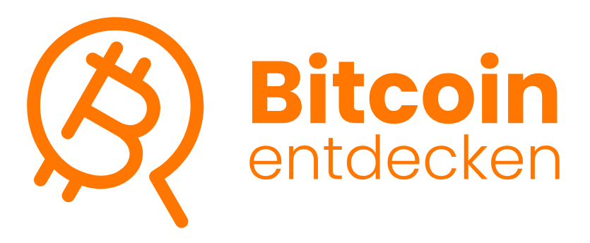

# **Bitcoin entdecken \- Open Source**



Dies ist das offizielle Open-Source-Repository für "Bitcoin entdecken": Brand, Marketingmaterialien, Präsentationen und Infomaterial für "Bitcoin entdecken"-Veranstaltungen — als offene Ressource für die gesamte Community. Die einheitliche Marke erleichtert Organisatoren die Arbeit und stärkt die Wiedererkennung.

## **Nutzung**

* **Brand Assets:** Logos, Farben und Schriftarten findest du im Ordner [`/brand-assets`](/brand-assets).  
* **Font:** Poppins Black, Poppins Regular
* **Color Codes:**
  * Orange: #FF7700
  * Dark Orange: #E35F00
  * Very Dark Orange: #BF5000
* **Vorlagen:** Nutzbare Vorlagen für Social Media, Präsentationen und Drucksorten liegen im Ordner [`/templates`](/templates).
* **Editierbare Eventvorlagen:** Datengetriebene Social-, Flyer-, Poster- und Bauzaunformate liegen unter [`/templates/events`](/templates/events). Datum, Ort und QR-Code werden aus einem gemeinsamen Eventdatensatz erzeugt.

Wir ermutigen dich ausdrücklich, diese Ressourcen für deine eigenen "Bitcoin entdecken"-Events zu verwenden\!

## **Präsentationen (fertige PDFs)**

Die LaTeX-Quellen liegen unter [`/slides`](/slides), die fertigen PDFs werden automatisch von GitHub Actions gebaut und als Release veröffentlicht. Die folgenden Links zeigen immer das **jeweils neueste Release** der Präsentation — das PDF hängt dort als Asset:

* **[Bitcoin — Erste Schritte](https://github.com/bitcoinaustria/bitcoin-entdecken/releases?q=ersteschritte&expanded=true)** — Einstieg: Wallet, erste Sats, Sicherheit
* **[Die häufigsten Missverständnisse](https://github.com/bitcoinaustria/bitcoin-entdecken/releases?q=missverstaendnisse&expanded=true)** — Mythen und Einwände, faktenbasiert entkräftet
* **[Bitcoin Ursprungs-Mythen](https://github.com/bitcoinaustria/bitcoin-entdecken/releases?q=mythen&expanded=true)** — Entstehungsgeschichte und was wirklich dahinter steckt

Eine Übersicht über alle Releases gibt es unter [Releases](https://github.com/bitcoinaustria/bitcoin-entdecken/releases).

## **AI Voice Skill**

Für alle, die mit AI-Agenten (Claude Code, Codex & Co.) Bildungsinhalte erstellen: Das Repo enthält unter [`.claude/skills/bitcoin-education-voice`](.claude/skills/bitcoin-education-voice/SKILL.md) einen Voice- und Stil-Guide für Bitcoin-Bildungsinhalte — Tonalität, Framing, Guardrails (keine Anlageberatung, kein Hype) und Format-Vorlagen für Slides, Social Media und Eventtexte.

Installation als eigenständiger Skill:

```bash
npx skills add bitcoinaustria/bitcoin-entdecken
```

In Claude Code wird der Skill beim Arbeiten in diesem Repo automatisch erkannt.

## **Beitragen**

Dieses Projekt lebt von der Community. Wir freuen uns über Pull Requests mit neuen Vorlagen, Verbesserungen oder Beispielen von deinen Events.

* **Wie du beitragen kannst:** Details findest du in der [`CONTRIBUTING.md`](CONTRIBUTING.md).
* **Erfahrungen teilen:** Teile deine Learnings und Tipps von vergangenen Events per Pull Request oder Issue.

## **Alternative Konzepte**

Im Ordner [`/brand-assets/alternative-logos`](/brand-assets/alternative-logos) findet ihr kinderfreundlichere Logo-Entwürfe von Chris Lüders. Bei Interesse an einer Weiterentwicklung dieser Ideen kontaktiert bitte Chris direkt: [**https://www.chrislueders.de/**](https://www.chrislueders.de/)

## **Danksagung**

Ein riesiges Dankeschön an den Designer und alle Sponsoren, die die Entstehung dieser Brand möglich gemacht haben:

* **Design:**
  * Chris Lüders | [Website](https://www.chrislueders.de/) | [X](https://x.com/chris_lueders_) | [Nostr](https://njump.me/npub1u2jks7zqnvdtnu8vkehtfa3aemtaqp30s3az9qxcesa7whxlw8rsgs50au)

* **Sponsoren:**  
  * [Satoshi Engineering](https://satoshiengineering.com/en/) \- Hauptorganisator
  * [Feinstoffstruktur](https://feinstoffstruktur.com/)  
  * [Coinfinity](https://coinfinity.co/)  
  * [EINUNDZWANZIG](https://einundzwanzig.space/)  
  * [21Bitcoin](https://21bitcoin.app/)  
  * [21Rebels.store](https://21rebel.store/)
  * [21Energy](https://21energy.com/)  
  * [BitcoinEnergyDrinks](https://shop-energydrink.com/)
  * [GoBRR](https://www.gobrrr.me/)
  * [DeliciousWien](https://delicious-wien.at/)
  * ... und alle weiteren Helfer!

## **Lizenz**

Alle Inhalte stehen unter der [MIT-Lizenz](https://opensource.org/licenses/MIT).
