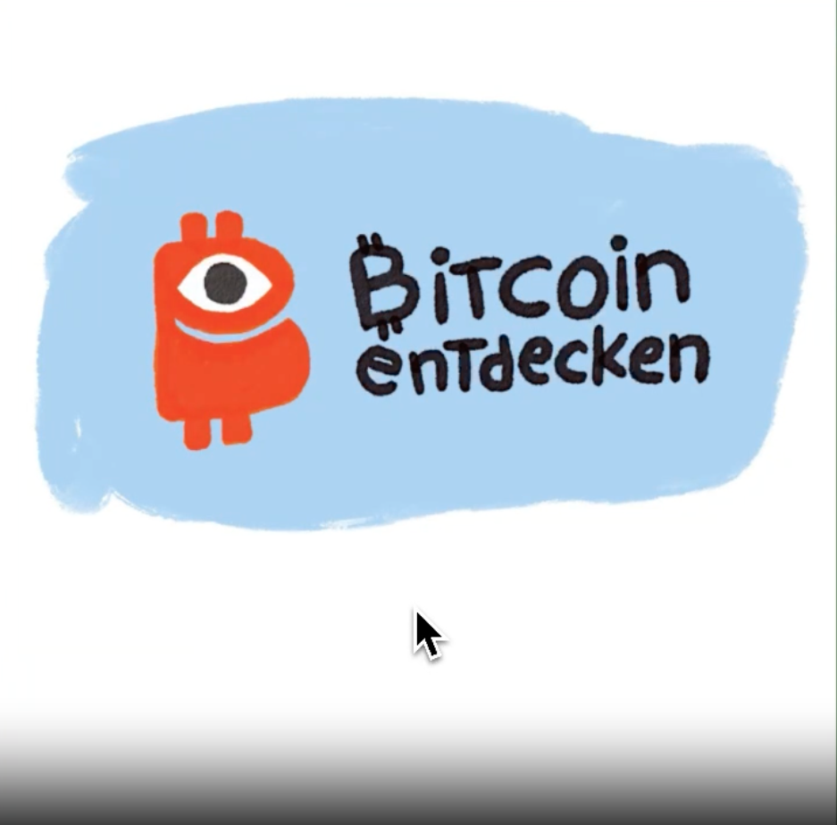
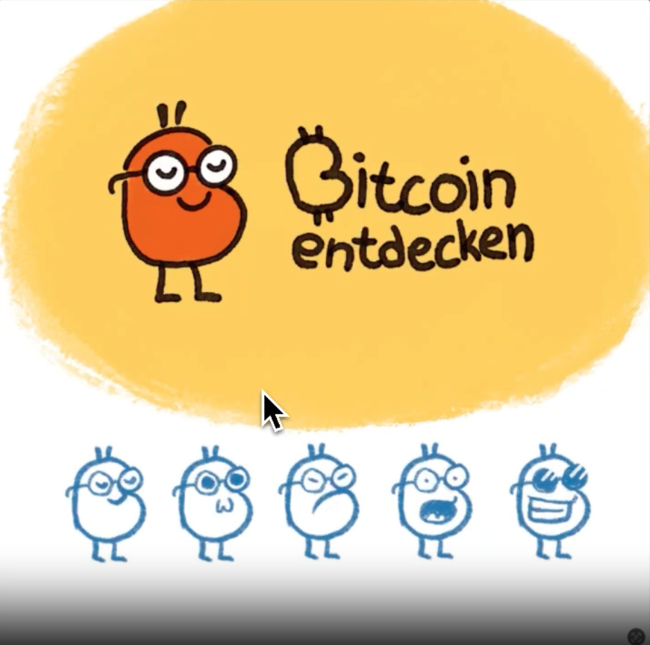
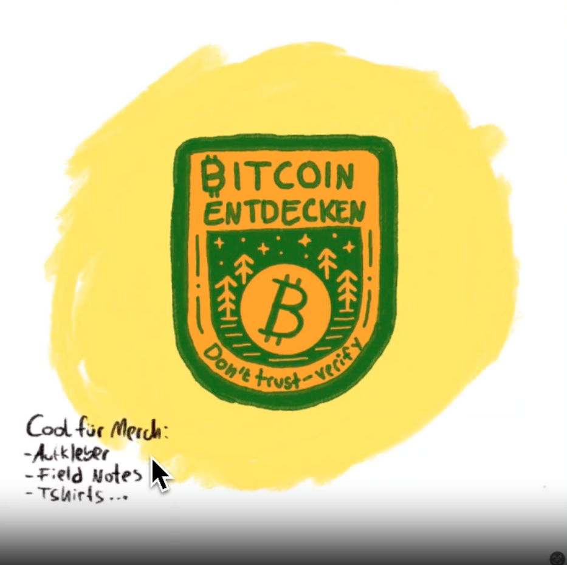

# Alternative Logos

Während der Gestaltung von „Bitcoin Entdecken“ wurden mehrere alternative Designansätze entwickelt. Diese erschienen jedoch für die damalige Veranstaltung als zu kindlich und nicht ausreichend zeitlos. Da wir die Entwürfe dennoch gelungen fanden, möchten wir sie euch nicht vorenthalten.

Hier findet ihr kinderfreundlichere Logo-Entwürfe von Chris Lüders, jeweils in dem Konzeptstatus, in dem sie sich befanden.

Bei Interesse an einer Weiterentwicklung dieser Ideen kontaktiert bitte Chris direkt: [**https://www.chrislueders.de/**](https://www.chrislueders.de/)

### Alternativen Ausarbeitung 1

### Alternativen Ausarbeitung 2

### Alternativen Ausarbeitung 3

### Alternativen Ausarbeitung 4

